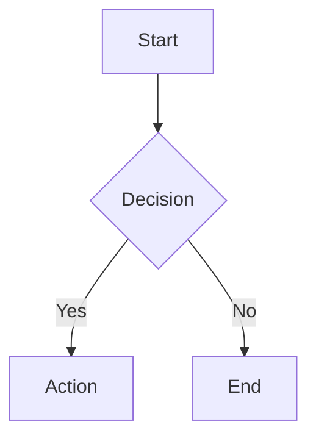

# Markdown Features and Extensions

VitePress Clear Blog extends standard Markdown with several useful features.

## Wiki Links

Use `[[post-name]]` syntax to link between posts. The theme resolves these to proper URLs and highlights broken links.

```markdown
See [[getting-started]] for more details.
```

## Footnotes

Add footnotes with the standard Markdown syntax[^1].

[^1]: This is a footnote that appears at the bottom of the page.

## MathJax

Write mathematical expressions with LaTeX syntax:

$$
E = mc^2
$$

Inline math: $a^2 + b^2 = c^2$

## Mermaid Diagrams



## Callouts

> [!NOTE]
> This is a note callout with important information.
