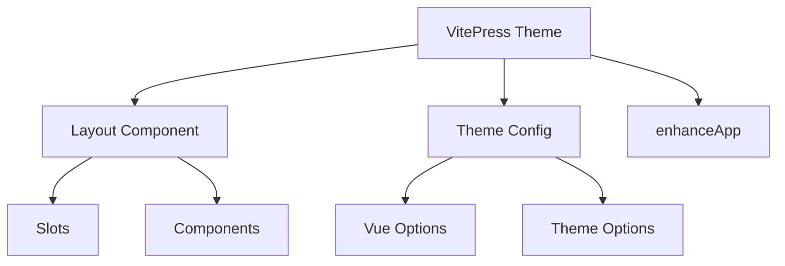
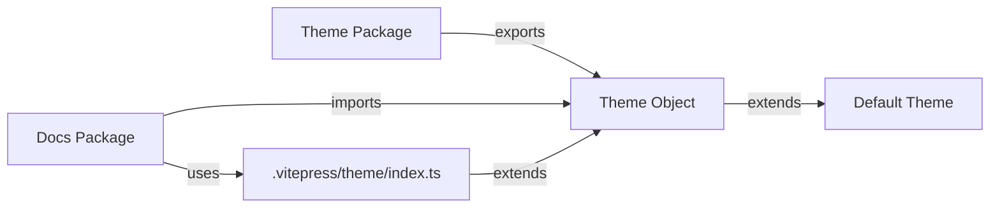
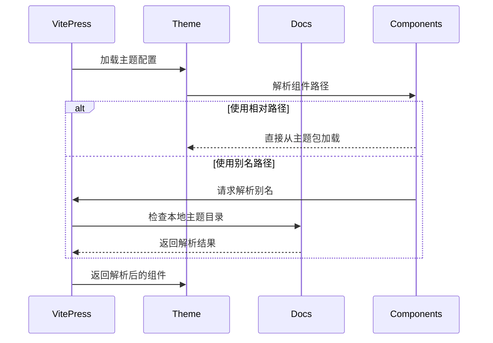
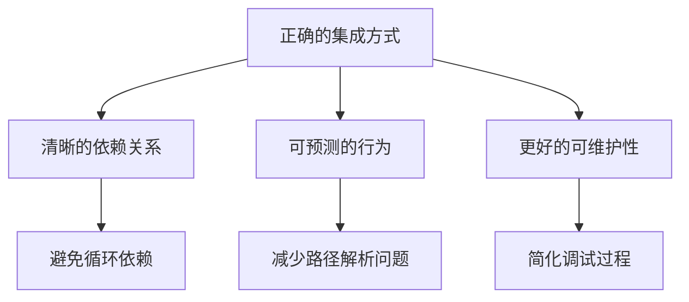

# VitePress 主题包与文档包的集成机制

## 1. 基本概念

### 1.1 VitePress 主题结构


### 1.2 主题包与文档包的关系


## 2. 正确的集成方式

### 2.1 主题包的导出
主题包需要导出一个完整的主题对象，这个对象包含了所有必要的配置和组件：

```typescript
// theme/src/index.ts
import DefaultTheme from 'vitepress/theme'
import Layout from './components/Layout.vue'

export default {
  extends: DefaultTheme,
  Layout,
  enhanceApp(ctx) {
    // 增强应用的配置
  }
}
```

### 2.2 文档包的使用
文档包应该直接使用主题包导出的对象，而不是尝试重新配置：

```typescript
// docs/.vitepress/theme/index.ts
import Theme from '@blog/theme'
export default Theme
```

## 3. 路径解析机制

### 3.1 组件路径解析流程


## 4. 常见问题与解决方案

### 4.1 路径解析问题
当使用别名路径时，VitePress 可能会优先在文档包的本地主题目录中查找组件，这可能导致组件无法找到。

### 4.2 最佳实践
1. 主题包：
   - 导出完整的主题对象
   - 使用相对路径引用内部组件
   - 明确定义主题的扩展点

2. 文档包：
   - 直接使用主题包的导出对象
   - 通过扩展点添加自定义功能
   - 避免重写主题的核心配置

## 5. 为什么这样做？

### 5.1 VitePress 的设计理念
VitePress 的主题系统设计基于以下原则：
- 可扩展性：允许主题被继承和扩展
- 模块化：主题包应该是独立的
- 一致性：主题的行为应该是可预测的

### 5.2 正确集成的好处


## 6. 调试与验证

当遇到集成问题时，可以通过以下步骤进行调试：
1. 检查主题包的导出是否完整
2. 验证文档包是否正确导入主题
3. 检查组件路径是否正确解析
4. 查看 VitePress 的构建日志

通过这种方式，我们可以确保主题包和文档包之间的集成是正确和可靠的。
