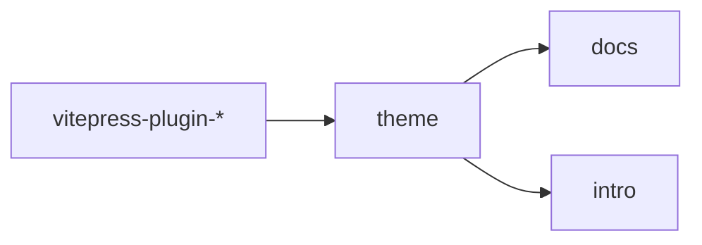

# 构建工具链

> tsup、Vite 与并行构建策略

## tsup 配置

### 插件/库打包

项目使用 tsup 打包 TypeScript 库：

```typescript
// tsup.config.ts
import { defineConfig } from 'tsup'

export default defineConfig({
  entry: ['src/index.ts'],
  format: ['esm', 'cjs'],
  dts: true,
  clean: true,
  external: ['vitepress', 'vue']
})
```

### 输出格式

| 格式 | 文件 | 用途 |
| ---- | ---- | ---- |
| ESM | `lib/index.js` | 现代打包器 |
| CJS | `lib/index.cjs` | Node.js |
| Types | `lib/index.d.ts` | TypeScript |

## Vite 构建

### VitePress 站点构建

```bash
# 构建文档站点
pnpm build:testbed

# 预览构建结果
pnpm preview:testbed
```

### 优化配置

```typescript
// vite 配置
{
  build: {
    rollupOptions: {
      output: {
        manualChunks: {
          'd3': ['d3'],
          'vue': ['vue', '@vueuse/core']
        }
      }
    }
  }
}
```

## 并行构建

### pnpm 命令

```bash
# 并行构建所有包
pnpm --parallel build

# 按依赖顺序构建
pnpm -r build

# 仅构建指定包
pnpm -F vitepress-clear-blog build
```

### 构建顺序



## 相关链接

- [[typescript|TypeScript 配置]]
- [[../monorepo/workspace|pnpm Workspace]]

---

