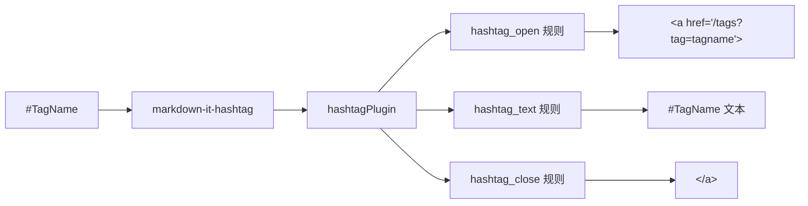

# Hashtag 标签增强

> 使用 `#TagName` 语法自动创建可点击的标签链接

## 简介

Hashtag 插件将 Markdown 中的 `#标签名` 语法自动转换为指向标签筛选页面的超链接。类似于 Twitter/X 或 Obsidian 中的标签功能，让文章中的标签引用变得自然流畅。

## 语法

```markdown
这篇文章提到了 #Vue3 和 #TypeScript 相关内容。

也支持多词标签：例如 #machine-learning

可以使用 #project/open-source 这样的路径式标签
```

## 效果演示

输入：

```markdown
今天我们讨论 #前端开发 中的状态管理方案。#Vue3 的
Composition API 配合 #Pinia 可以很好地解决这个问题。
```

渲染后的标签会变成可点击的链接，指向标签筛选页面：

这篇文章讨论了
<a href='/tags?tag=前端开发' class='blog-tag'>#前端开发</a>
中的状态管理方案。
<a href='/tags?tag=vue3' class='blog-tag'>#Vue3</a>
的 Composition API 配合
<a href='/tags?tag=pinia' class='blog-tag'>#Pinia</a>
可以很好地解决这个问题。

## 配置选项

在 `config.toml` 的 `[markdown]` 节中配置：

```toml
[markdown]
# 启用 Hashtag 解析（默认开启）
hashtag = true
```

### 禁用 Hashtag

如果需要关闭 Hashtag 功能：

```toml
[markdown]
hashtag = false
```

## 工作原理



### 渲染规则

| 规则 | 输出 |
| ---- | ---- |
| `hashtag_open` | `<a href='/tags?tag={小写标签名}' class='blog-tag'>` |
| `hashtag_text` | `#{标签原文}` |
| `hashtag_close` | `</a>` |

标签名会被转为**小写**后放入查询参数，保证 URL 统一。CSS 类 `blog-tag` 可用于自定义标签链接样式。

## 技术细节

- 基于 `markdown-it-hashtag` 社区插件
- 在主题的 `configProvider.ts` 中自动注册
- `createBlog()` 过程中加载，无需手动配置
- 标签颜色和样式通过 `blog-tag` CSS 类控制

## 相关链接

- [[markdown-enhance|Markdown 增强]]
- [[../monorepo/plugins|插件体系]]
- [[search-and-nav|搜索与导航]] — 标签云 / 标签筛选

---

