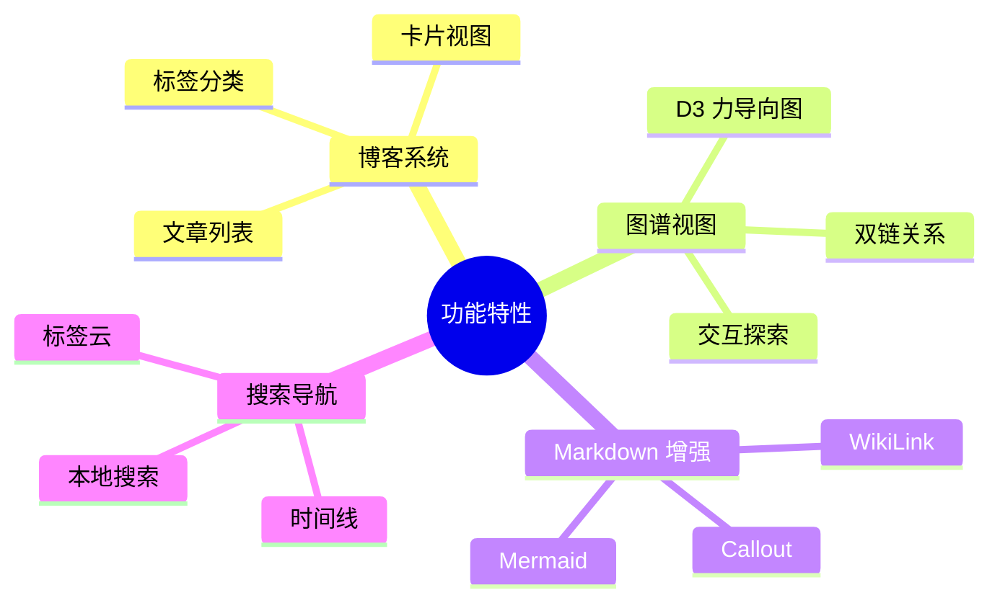

# ✨ 功能特性

> 本章节介绍项目的主要功能特性

## 功能概览

项目提供丰富的博客功能，旨在打造类 Obsidian 的双链笔记体验：

## 文档列表

### [[feature-overview|📋 功能概览]]
- 项目全部功能完整清单
- 130+ 功能实现状态
- 从基础 Markdown 到高级特性

### [[blog-system|博客系统]]
- 文章列表与卡片视图
- 标签与分类系统
- 归档与时间线

### [[graph-view|图谱视图]]
- D3.js 力导向图
- 双链关系可视化
- 交互式探索

### [[markdown-enhance|Markdown 增强]]
- WikiLink 双向链接
- Callout 提示框
- Mermaid 图表
- 代码折叠

### [[hashtag-plugin|Hashtag 标签]]
- `#TagName` 语法自动链接
- 标签筛选集成
- 可配置开关

### [[search-and-nav|搜索与导航]]
- 本地全文搜索
- 时间线视图
- 标签云导航

