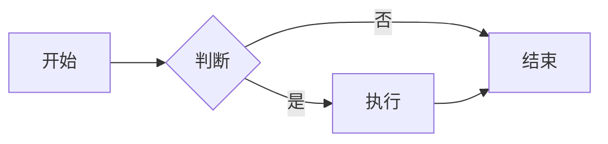
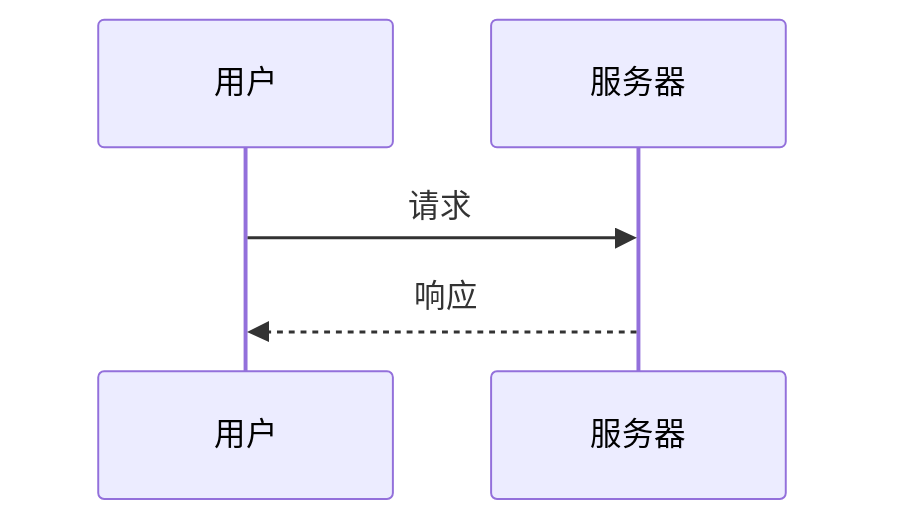
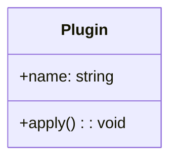

# Markdown 增强

> WikiLink、Callout、Mermaid 等增强功能

## WikiLink 双向链接

### 语法

```markdown
<!-- 基础链接 -->
[[文档名称]]

<!-- 带别名 -->
[[文档名称|显示文本]]

<!-- 带路径 -->
[[/path/to/doc|链接文本]]
```

### 示例

- [[graph-view|图谱视图]] - 使用 WikiLink 语法
- [[../tech-stack/index|技术选型]] - 链接到目录

## Callout 提示框

### 语法

```markdown
> [!note] 标题
> 提示框内容

> [!warning] 警告
> 警告内容

> [!tip] 技巧
> 技巧内容
```

### 支持类型

| 类型 | 样式 |
| ---- | ---- |
| `note` | 蓝色信息框 |
| `tip` | 绿色提示框 |
| `warning` | 黄色警告框 |
| `danger` | 红色危险框 |
| `info` | 灰色信息框 |

### 效果演示

> [!note] 这是一个提示
> 使用 Callout 语法可以创建美观的提示框

## Mermaid 图表

### 流程图



### 序列图



### 类图



## 代码增强

### 代码折叠

长代码块自动折叠：

```typescript
// 这是一段很长的代码
// 会自动折叠
// ...
```

### 行高亮

```typescript{2,4}
const a = 1
const b = 2  // 高亮
const c = 3
const d = 4  // 高亮
```

## 相关链接

- [[graph-view|图谱视图]] - 利用 WikiLink 构建
- [[../monorepo/plugins|插件体系]] - 实现原理

---

