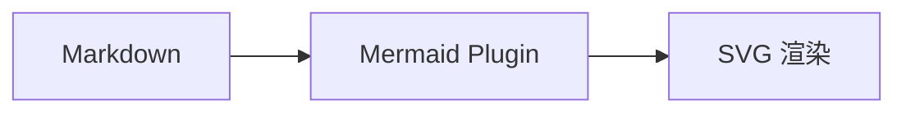
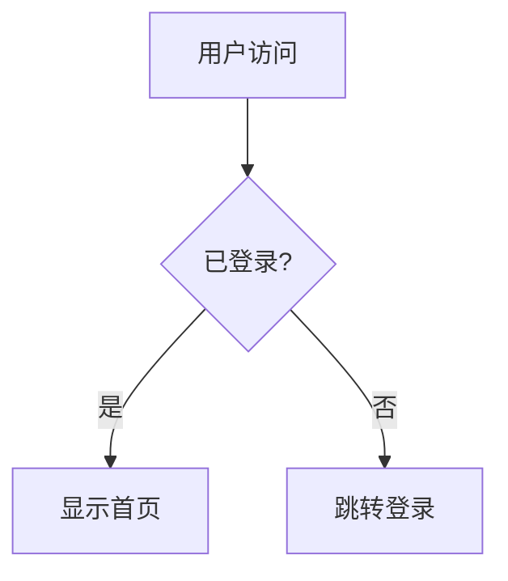

# 可视化方案

> D3.js 与 Mermaid 在项目中的应用

## D3.js 力导向图

### Graph View 实现

项目实现了类 Obsidian 风格的图谱视图：

```typescript
// 力导向图核心配置
const simulation = d3.forceSimulation(nodes)
  .force('link', d3.forceLink(links).id(d => d.id))
  .force('charge', d3.forceManyBody().strength(-300))
  .force('center', d3.forceCenter(width / 2, height / 2))
```

### 功能特性

- 🔗 双链关系可视化
- 🖱️ 拖拽交互
- 🔍 节点高亮
- 📱 响应式布局

## Mermaid 图表

### 支持的图表类型



### 集成方式

通过 `markdown-it` 插件实现：

```typescript
md.use(mermaidPlugin)
```

### 示例：流程图



## 相关链接

- [[../features/graph-view|图谱视图功能]] - 功能详细说明
- [[vue3-ecosystem|Vue3 生态]] - 前端技术栈

---

