# Mermaid 图表类型大全

Mermaid 扩展支持在 Markdown 中书写 20+ 种图表类型。本文是完整的语法展示。

## 流程图

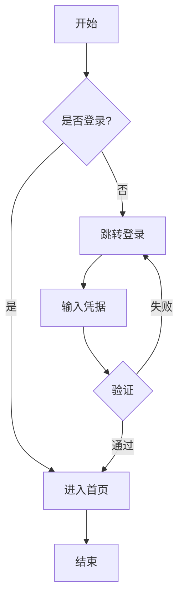

## 带样式的流程图

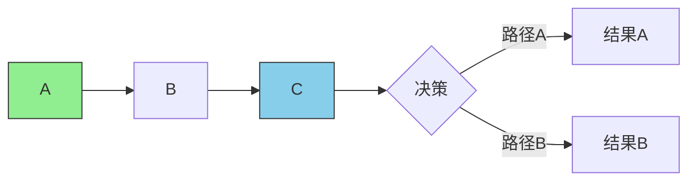

## 时序图

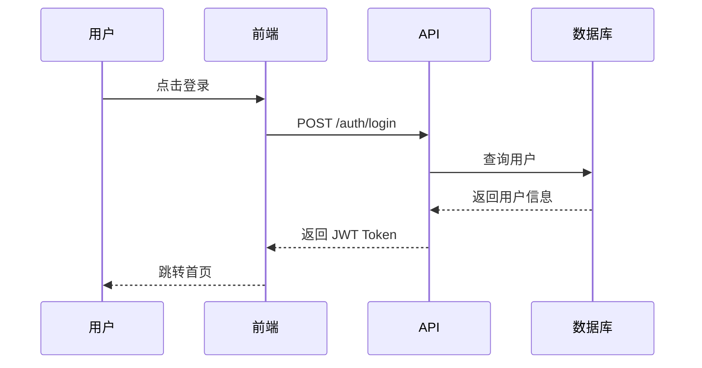

## 带循环和条件的时序图

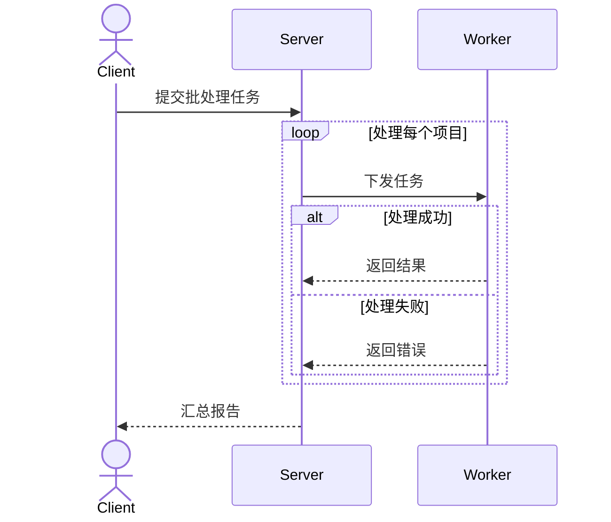

## 类图

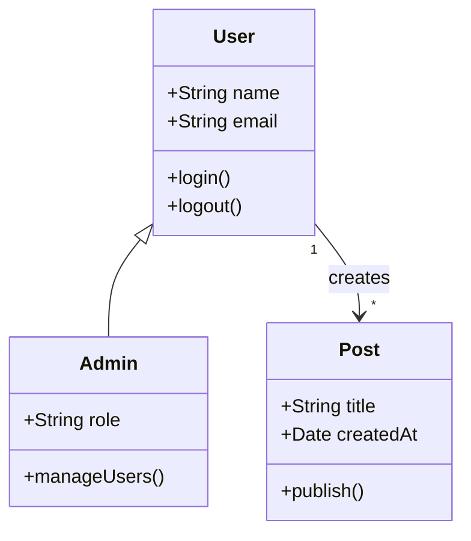

## 状态图

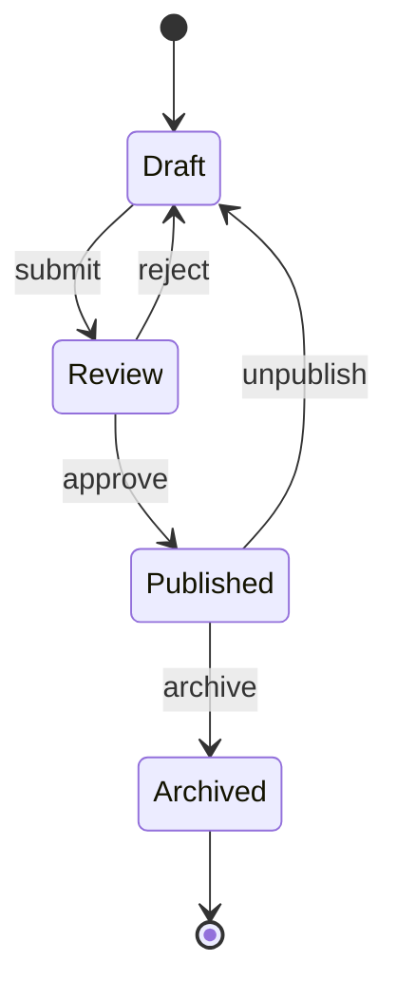

## 实体关系图

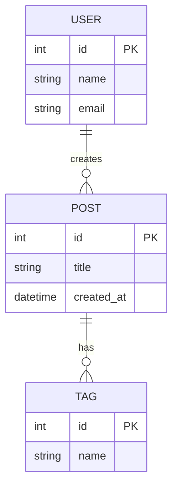

## 甘特图

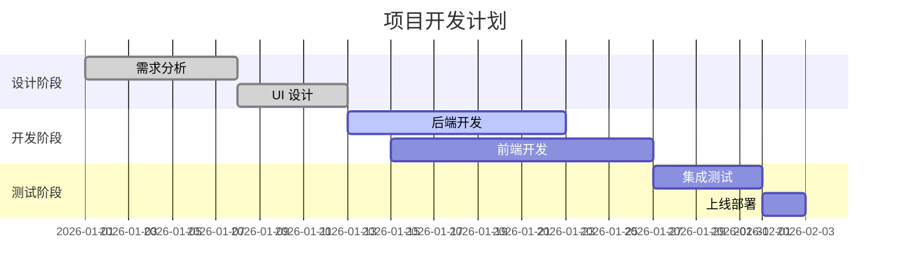

## 饼图

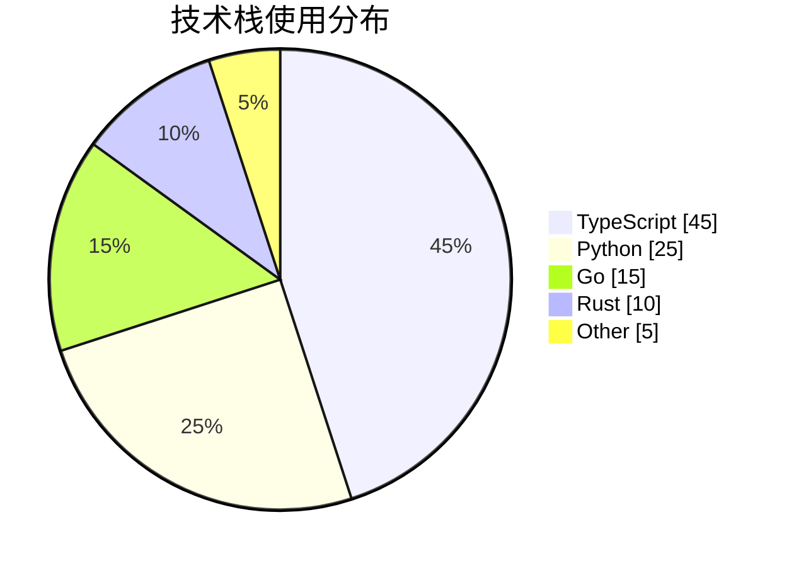

## Git 分支图

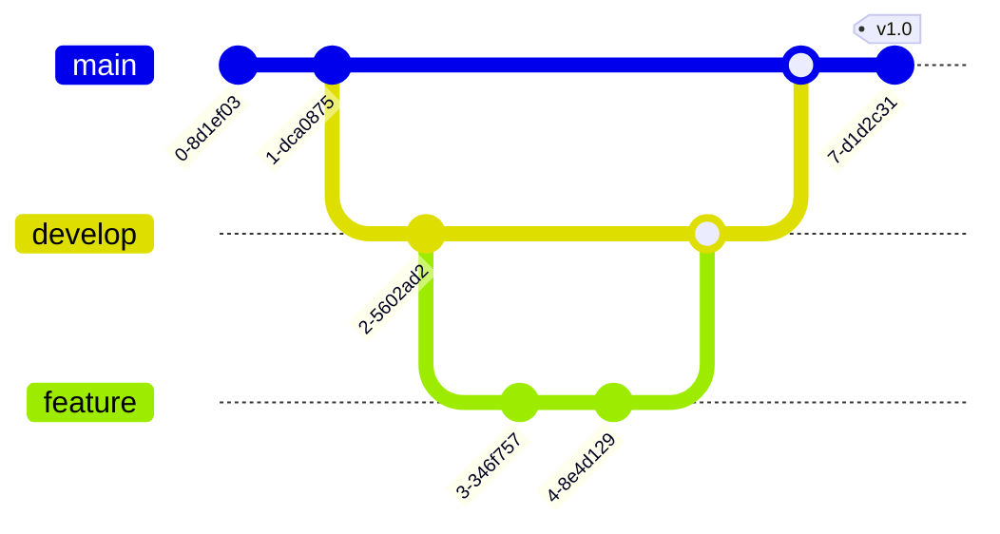

## 思维导图

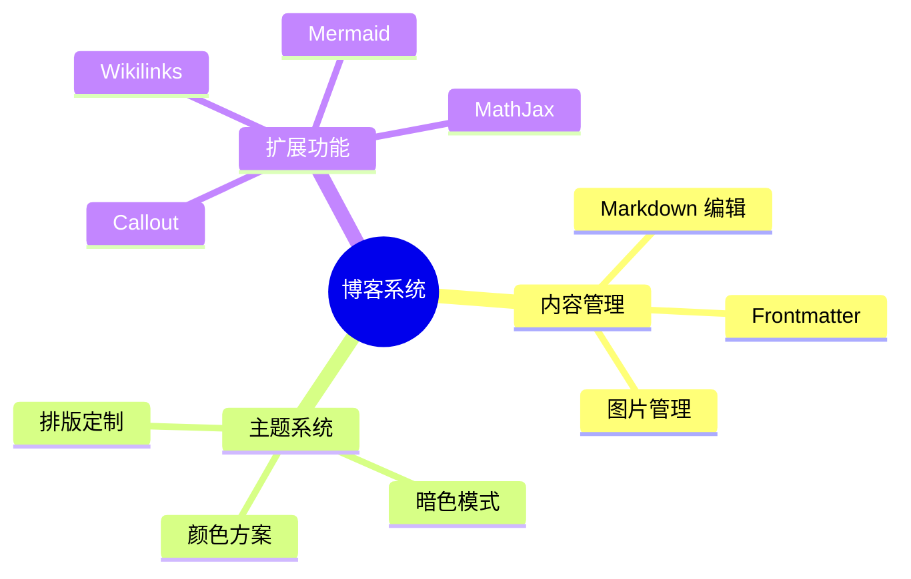

## 时间线图

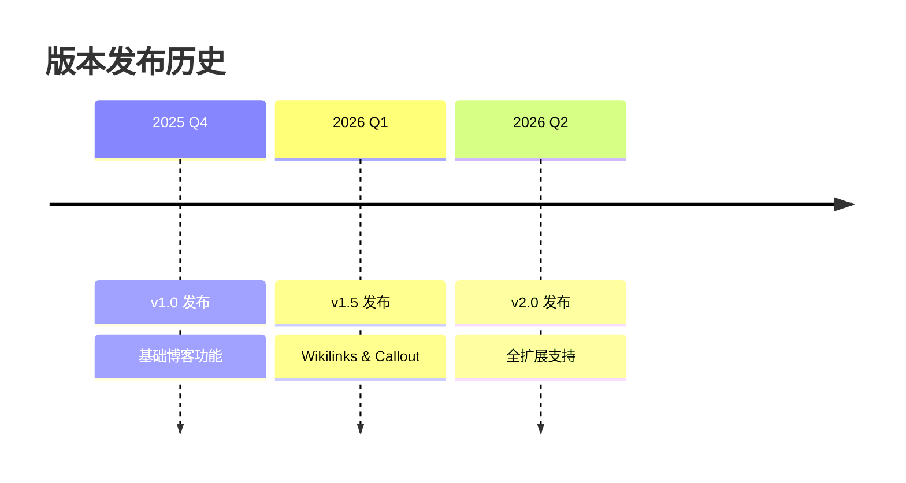

## Sankey 图

```mermaid
sankey-beta
    用户访问,首页,500
    首页,博客列表,400
    首页,标签页,100
    博客列表,文章详情,350
    标签页,文章详情,80
```

## 象限图

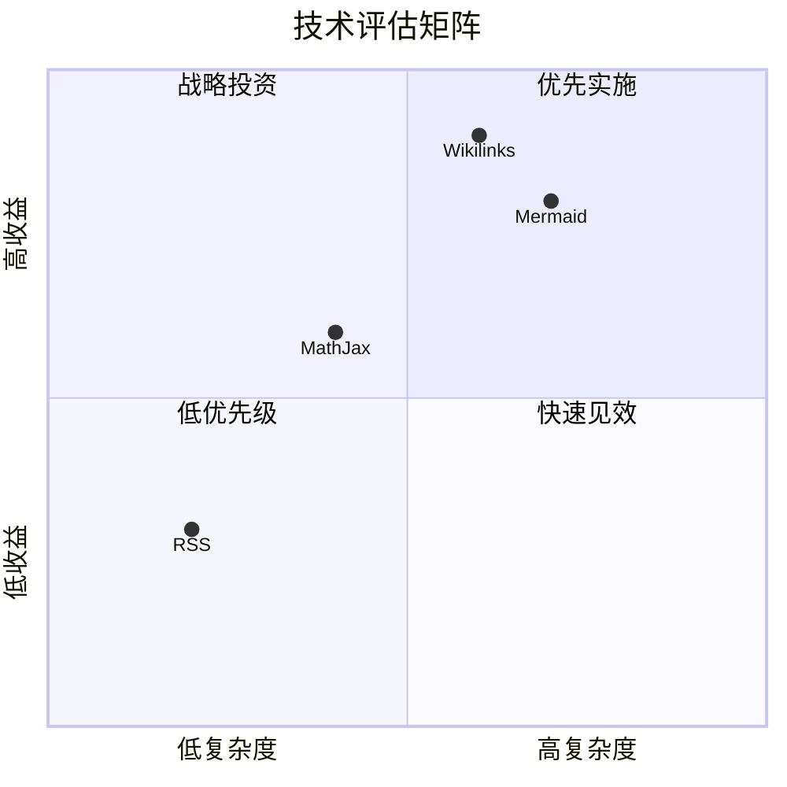

## 相关文档

- [[../callout-types|Callout 类型]]
- [[../mathjax-showcase|MathJax 展示]]
- [[../markdown-features|Markdown 功能总览]]
- [[../../d3-force-graph|D3 力导向图]]
