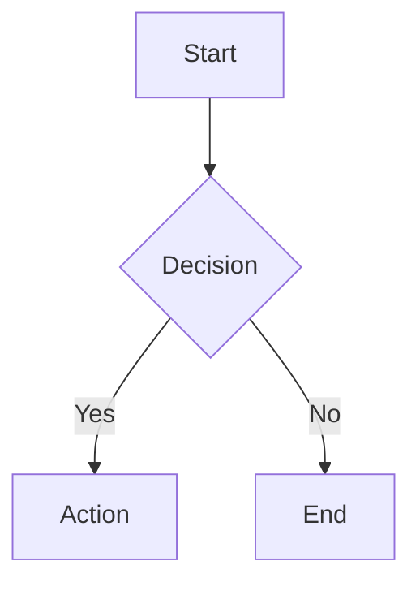

# Markdown Features and Extensions

VitePress Theme Link extends standard Markdown with several useful features.

## Wiki Links

Use `[[post-name]]` syntax to link between posts. The theme resolves these to proper URLs and highlights broken links.

```markdown
See [[getting-started]] for more details.
```

## Footnotes

Add footnotes with the standard Markdown syntax[^1].

[^1]: This is a footnote that appears at the bottom of the page.

## MathJax

Write mathematical expressions with LaTeX syntax:

$$
E = mc^2
$$

Inline math: $a^2 + b^2 = c^2$

## Mermaid Diagrams



## Callouts

> [!NOTE]
> This is a note callout with important information.

## 扩展阅读

每项功能都有详细的专题文档：

- [[basics/text-formatting|文本格式化全解]]
- [[basics/code-and-syntax-highlight|代码块与语法高亮]]
- [[basics/tables-lists-images|表格、列表与图片]]
- [[extensions/mathjax-showcase|MathJax 数学公式全展示]]
- [[extensions/mermaid-diagrams-comprehensive|Mermaid 图表类型大全]]
- [[extensions/footnote-system|脚注系统详解]]
- [[extensions/callout-types|Callout 提示块类型全览]]
- [[extensions/hashtag-discovery|Hashtag 标签发现]]
- [[extensions/details-block-fold|可折叠详情块]]
- [[wikilinks/wikilinks-basic-guide|Wiki Links 基础入门]]
- [[wikilinks/wikilinks-advanced-techniques|Wiki Links 高级技巧]]
