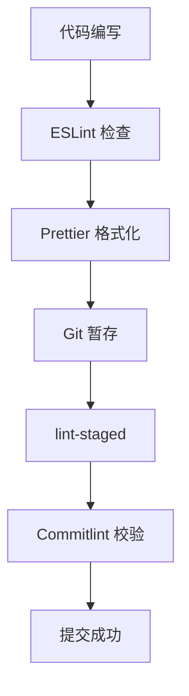

# 🏗️ 工程规范化基座

> 本章节介绍项目的工程化配置体系

## 概览

项目建立了完善的工程规范化体系：

## 工具链一览

| 工具 | 版本 | 用途 |
| ---- | ---- | ---- |
| ESLint | 9.39.2 | 代码质量检查 |
| Prettier | 3.7.4 | 代码格式化 |
| TypeScript | 5.9.3 | 类型系统 |
| Husky | latest | Git Hooks |
| Commitlint | latest | 提交信息校验 |
| lint-staged | latest | 暂存区检查 |

## 文档列表

### [[eslint-prettier|ESLint & Prettier]]
- ESLint Flat Config 配置
- Prettier 格式化规则
- 两者协同工作

### [[typescript|TypeScript 配置]]
- 严格模式配置
- 路径别名
- 类型声明

### [[commit-lint|Git 提交规范]]
- Conventional Commits 规范
- Husky 钩子配置
- Commitlint 规则

### [[build-toolchain|构建工具链]]
- tsup 打包配置
- Vite 构建优化
- 并行构建策略

