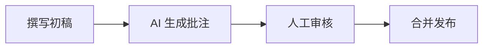

# 脚注增强

> 🤖 让 AI 成为你的技术博客点评官

## 功能概述

脚注增强功能不仅支持传统的引用和注释，更重要的是，它可以结合 **Prompt 工程**，让 AI 为技术博客生成专业的批注和点评。

## 核心理念

**人类撰写正文，AI 补充批注** — 这是一种全新的人机协作写作模式：

- 📝 **人类**：撰写技术博客的核心内容
- 🤖 **AI**：点评、质询、补充关键细节

## AI 批注的使用场景

### 1. 技术观点质询

让 AI 对文章中的技术观点提出质疑和深入讨论：

```markdown
Vue 3 的 Composition API 比 Options API 更适合大型项目[^ai-review-1]。

[^ai-review-1]: 🤖 **AI 点评**：这个观点在大多数场景下成立，但需要考虑团队的学习曲线。
Options API 对于熟悉 Vue 2 的团队来说更容易上手，而 Composition API 
在代码复用和 TypeScript 支持方面确实更有优势。建议根据团队实际情况选择。
```

### 2. 代码审查批注

AI 可以对代码示例进行专业的 Code Review：

```markdown
这是一个简单的防抖函数实现[^ai-code-review]：

\`\`\`typescript
function debounce(fn: Function, delay: number) {
  let timer: any
  return function(...args: any[]) {
    clearTimeout(timer)
    timer = setTimeout(() => fn(...args), delay)
  }
}
\`\`\`

[^ai-code-review]: 🤖 **AI 代码审查**：
1. `any` 类型过于宽松，建议使用泛型增强类型安全
2. 缺少 `this` 上下文绑定，可能导致方法调用时 `this` 丢失
3. 考虑添加 `immediate` 参数支持首次立即执行
```

### 3. 知识补充

AI 补充相关的背景知识和扩展阅读：

```markdown
React 的虚拟 DOM diff 算法采用了同层比较策略[^ai-knowledge]。

[^ai-knowledge]: 🤖 **AI 补充**：同层比较（Same Level Comparison）是 React 
reconciliation 算法的核心优化。它假设不同类型的元素会产生不同的树结构，
因此只比较同一层级的节点。这将 O(n³) 的复杂度降低到 O(n)。
相关阅读：React 官方文档 - Reconciliation
```

### 4. 最佳实践建议

让 AI 根据内容提供最佳实践建议：

```markdown
我们在项目中使用了全局状态管理[^ai-best-practice]。

[^ai-best-practice]: 🤖 **最佳实践建议**：
- 避免将所有状态都放入全局 store
- 组件内部状态应保持在组件内
- 使用 composables 共享可复用的状态逻辑
- 考虑使用 Pinia 替代 Vuex，它有更好的 TypeScript 支持
```

## Prompt 工程模板

### 通用批注生成 Prompt

```text
你是一位资深的技术博客评审员。请阅读以下技术文章，并为关键观点和代码添加批注。

批注要求：
1. 使用脚注格式 [^ai-xxx]
2. 批注以 "🤖 **AI xxx**：" 开头
3. 提供有价值的补充、质疑或建议
4. 语言简洁专业

文章内容：
---
[粘贴你的文章内容]
---

请输出带批注的 Markdown 文本。
```

### 代码审查 Prompt

```text
请审查以下技术博客中的代码示例，生成专业的代码审查批注：

审查重点：
- 类型安全性
- 性能考量
- 边界情况处理
- 最佳实践遵循

使用 Markdown 脚注格式输出。
```

### 技术深度点评 Prompt

```text
作为技术专家，请对以下文章的技术观点进行深度点评：

点评维度：
- 观点的准确性
- 适用场景的局限性
- 可能的替代方案
- 值得深入探讨的点

用脚注批注的形式输出。
```

## 工作流建议

### 推荐流程



1. **撰写初稿** - 专注于核心内容
2. **AI 生成批注** - 使用 Prompt 让 AI 添加批注
3. **人工审核** - 筛选有价值的批注
4. **合并发布** - 将批注整合到文章中

### 批注风格约定

| 标识 | 用途 |
| ---- | ---- |
| `[^ai-review-N]` | 技术观点评审 |
| `[^ai-code-N]` | 代码审查 |
| `[^ai-note-N]` | 知识补充 |
| `[^ai-tip-N]` | 最佳实践 |
| `[^ai-question-N]` | 提出问题 |

## 基础语法回顾

### 行内脚注

```markdown
这是需要补充说明的文字[^1]。

[^1]: 这里是脚注的具体内容。
```

### 多行脚注

```markdown
复杂的内容需要更详细的说明[^detail]。

[^detail]:
    第一行说明。
    第二行说明。
    
    甚至可以包含代码块。
```

## 相关链接

- [[llms-txt|llms.txt 规范]]
- [[index|LLM 友好支持概览]]
- [[../features/markdown-enhance|Markdown 增强功能]]

---
