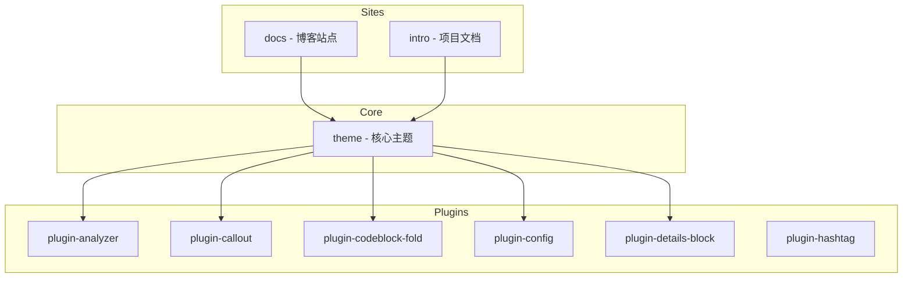

# 包职责划分

> 各包功能定位与依赖关系

## 包概览



## 详细说明

### 站点包

| 包名 | 类型 | 说明 |
| ---- | ---- | ---- |
| `docs` | private | 主博客站点，展示主题效果 |
| `intro` | private | 项目介绍文档站点 |

### 核心包

| 包名 | 发布名 | 说明 |
| ---- | ---- | ---- |
| `theme` | `vitepress-theme-link` | 主题核心，包含组件、样式、配置 |

### 插件包

| 包名 | 功能 |
| ---- | ---- |
| `vitepress-plugin-analyzer` | 内容分析、统计 |
| `vitepress-plugin-callouts` | Obsidian 风格提示框 |
| `vitepress-plugin-codeblock-fold` | 代码块折叠 |
| `vitepress-plugin-config` | 配置工具函数 |
| `vitepress-plugin-details-block` | 折叠详情块 |
| `vitepress-plugin-hashtag` | 标签支持 |

## 依赖关系

```typescript
// docs/package.json
{
  "dependencies": {
    "vitepress-theme-link": "workspace:*",
    "vitepress-plugin-analyzer": "workspace:*",
    "vitepress-plugin-callouts": "workspace:*",
    "vitepress-plugin-config": "workspace:*"
  }
}
```

## 相关链接

- [[theme-package|Theme 核心包]]
- [[plugins|插件体系]]

---

