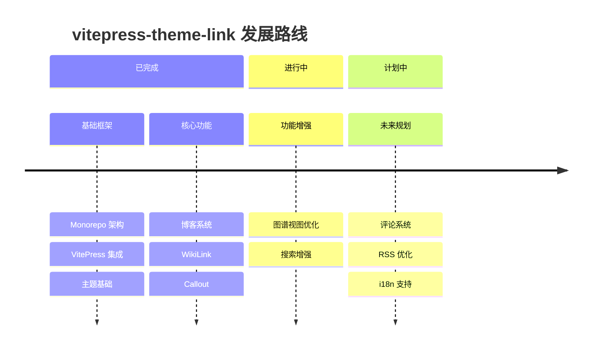

# 🗺️ 路线图

> 项目发展规划与功能迭代

## 概览

```mermaid
timeline
    title vitepress-theme-link 发展路线
    
    section 已完成
        基础框架 : Monorepo 架构
                 : VitePress 集成
                 : 主题基础
        
        核心功能 : 博客系统
                 : WikiLink
                 : Callout
    
    section 进行中
        功能增强 : 图谱视图优化
                 : 搜索增强
    
    section 计划中
        未来规划 : 评论系统
                 : RSS 优化
                 : i18n 支持
```

## 文档列表

### [[done|✅ 已完成]]
- 已发布功能清单
- 历史版本记录

### [[in-progress|🚧 进行中]]
- 当前开发重点
- 预计完成时间

### [[planned|📋 计划中]]
- 未来功能规划
- 社区需求收集

