# Mermaid Diagrams Showcase

This page tests all major Mermaid diagram types across both ASCII (`beautiful-mermaid`) and SVG (`mermaid`) rendering paths.

---

## Flowchart (ASCII)

### Basic Flow

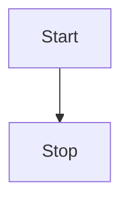

### Decision Tree

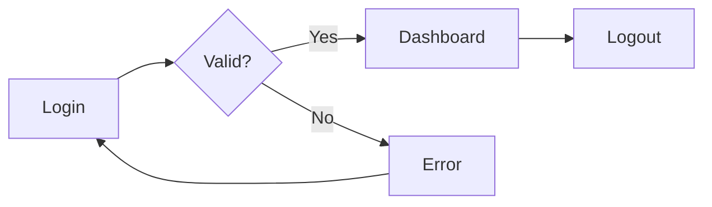

### With Subgraphs

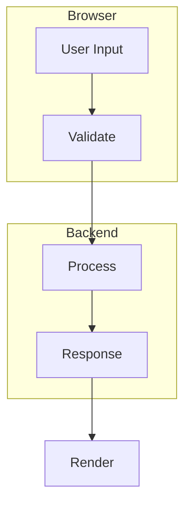

### Styled Nodes

```mermaid
flowchart LR
  A:::start --> B:::process --> C:::end
  classDef start fill:#7fb,stroke:#333
  classDef process fill:#bbf,stroke:#333
  classDef end fill:#f96,stroke:#333
```

---

## Sequence Diagram (ASCII)

### Basic Interaction

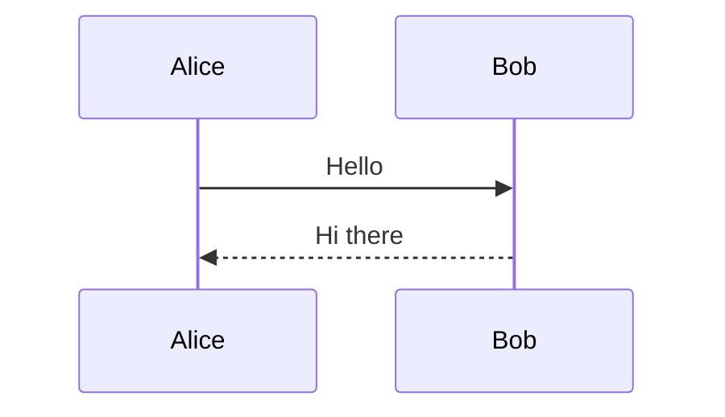

### With Notes, Loops, and Alt

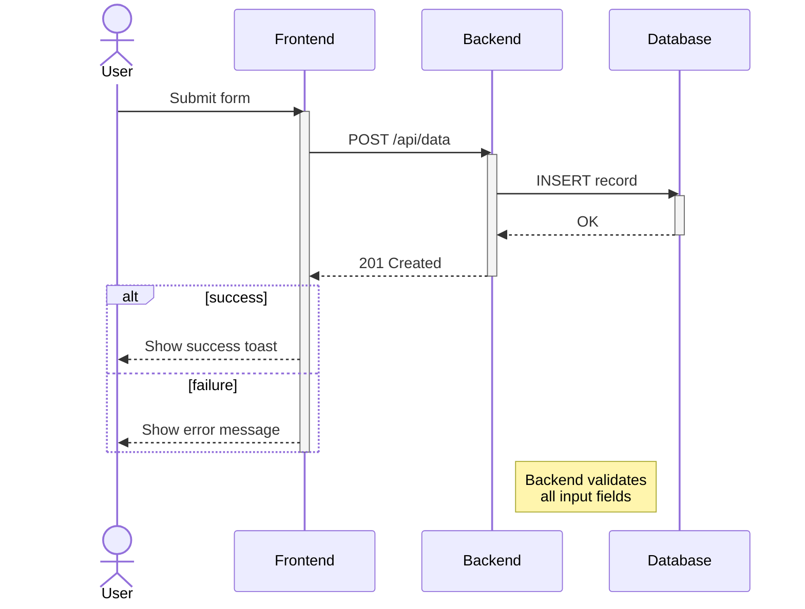

---

## Class Diagram (ASCII)

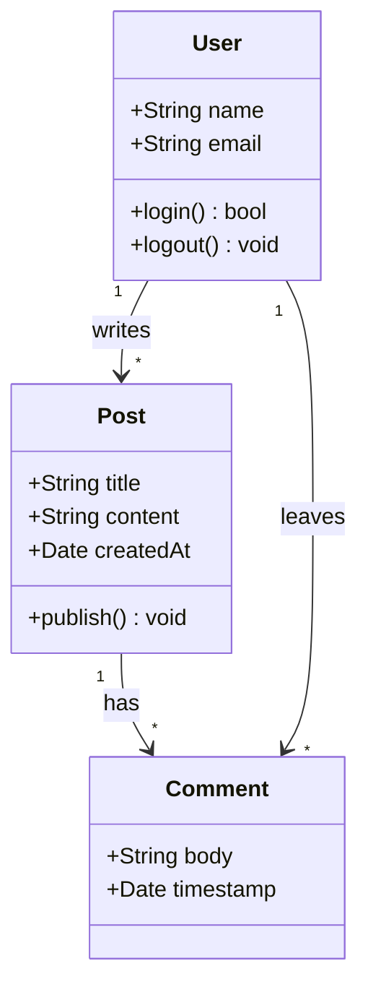

---

## State Diagram (ASCII)

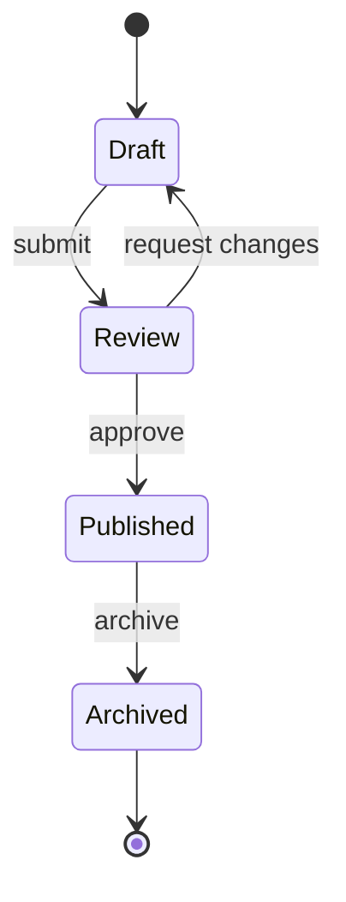

### Composite States

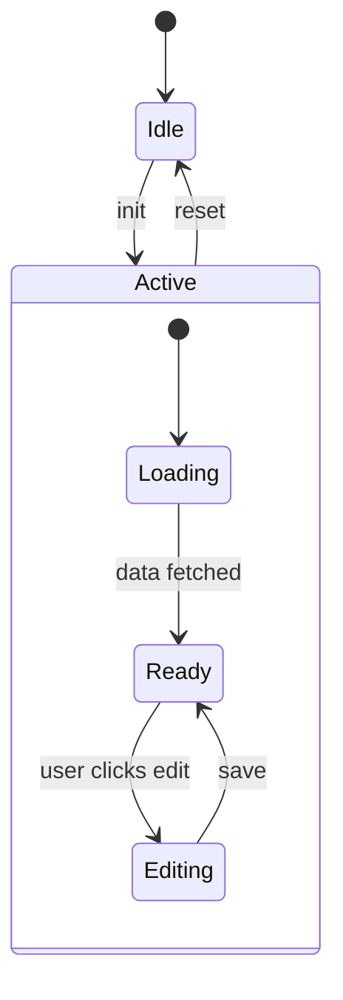

---

## Entity Relationship Diagram (ASCII)

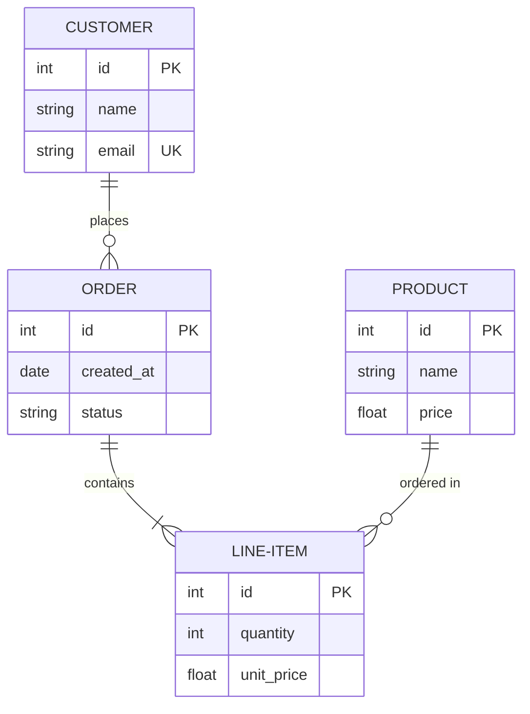

---

## XY Chart (ASCII)

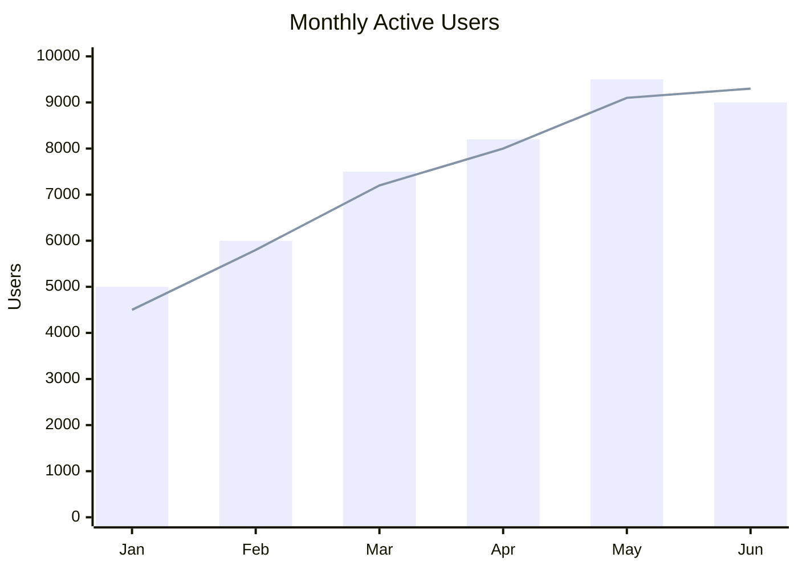

---

## Gantt Chart (SVG)

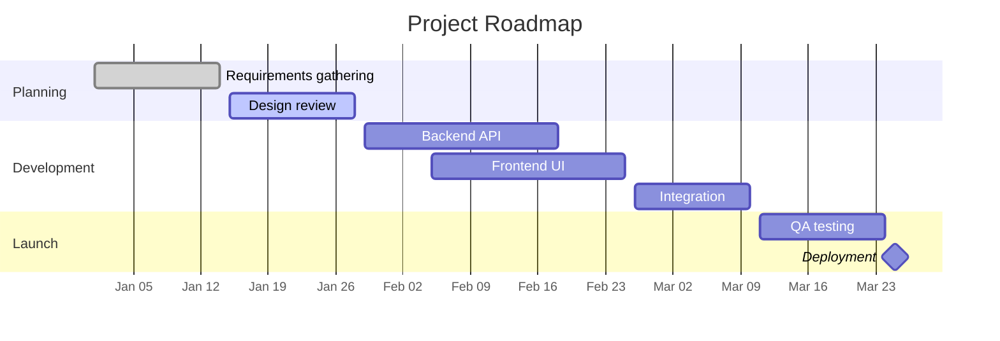

---

## Pie Chart (SVG)

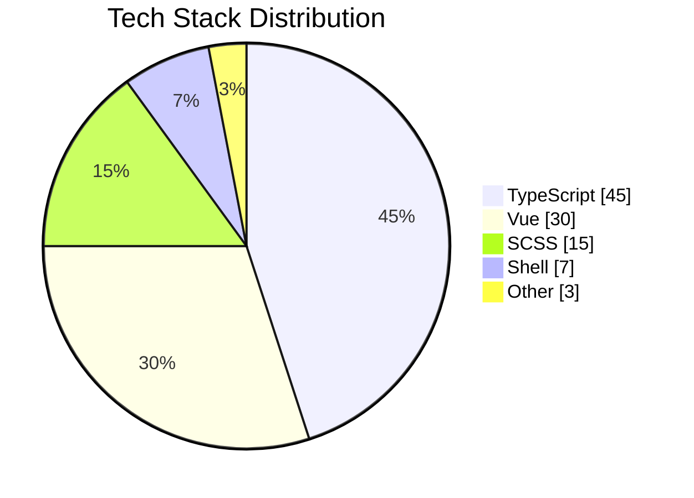

---

## Git Graph (SVG)

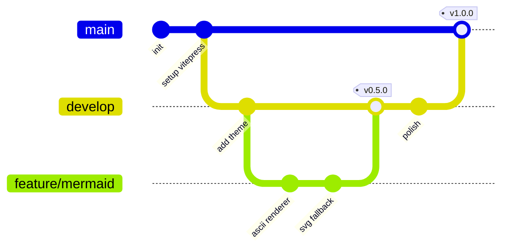

---

## Mindmap (SVG)

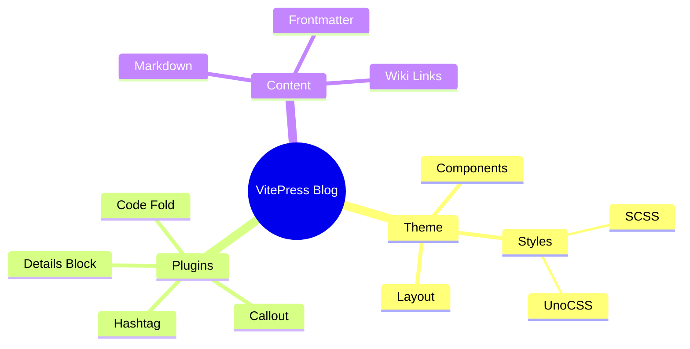

---

## Timeline (SVG)

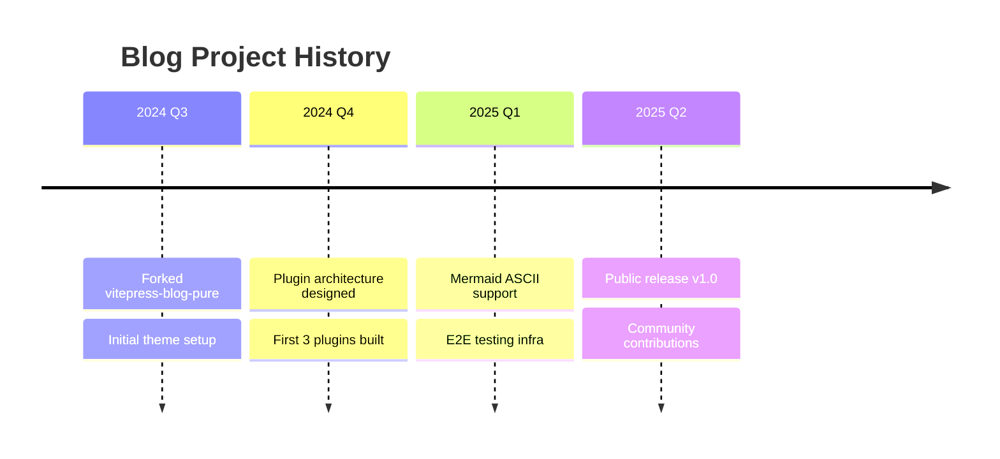

---

## User Journey (SVG)

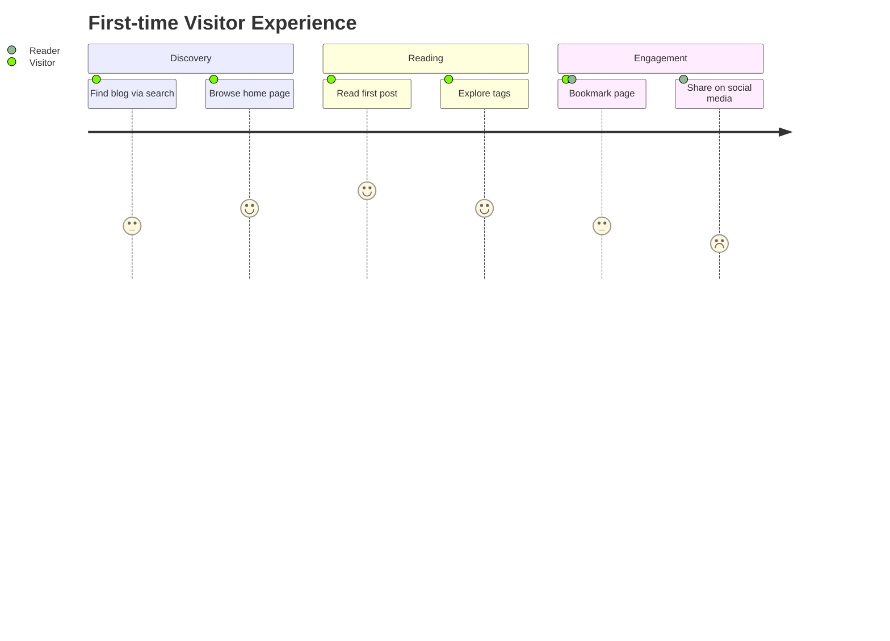

---

## Sankey Diagram (SVG)

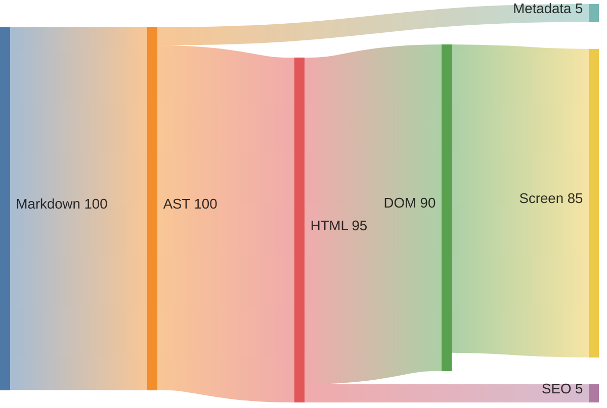

---

## Negative Samples: Unsupported Mermaid Syntax

These examples intentionally use Mermaid syntax that the renderer cannot handle. They should render as error cards instead of breaking the page.

### No Diagram Type Declared

```mermaid
this is not valid mermaid syntax at all
just some random text
```

### Invalid Graph with Broken Characters

```mermaid
graph TD
  A[Start] --> B[Process]
  B --> C[End
```

### Sequence Diagram with Undefined Actor

```mermaid
sequenceDiagram
  Alice->>Bob: Hello
  Bob-->>Alice: Hi
  Alice->>UndefinedActor: This should fail
```

---

## C4 Context Diagram (SVG)

```mermaid
C4Context
  title System Context Diagram — Blog Platform

  Person(reader, "Reader", "Visits the blog")
  Person(author, "Author", "Writes posts")

  System(blog, "Blog System", "Serves content via SSG")

  System_Ext(cdn, "CDN", "Static asset delivery")
  System_Ext(analytics, "Analytics", "Page views tracking")
  System_Ext(git, "GitHub", "Source and CI/CD")

  Rel(reader, blog, "Reads posts via", "HTTPS")
  Rel(author, git, "Pushes markdown to")
  Rel(blog, cdn, "Serves assets through")
  Rel(blog, analytics, "Reports metrics to")
```

### C4 Container Diagram: Unsupported Nested Boundary Syntax

```mermaid
C4Container
  title Container Diagram — Blog Platform

  Person(reader, "Reader", "End user")

  System_Boundary(blog, "Blog System") {
    Container(theme, "VitePress Theme", "Vue 3 + UnoCSS", "Renders markup to HTML")
    Container(plugins, "Plugin Suite", "TypeScript", "Markdown enhancements")
    Container(build, "Vite Build", "Vite", "Static site generation")
  }

  Container_Ext(cdn, "CDN", "Serves static files")

  Rel(reader, cdn, "Requests page", "HTTPS")
  Rel(cdn, blog, "Caches output from")
  Rel(theme, plugins, "Uses")
  Rel(build, theme, "Bundles")
```

---

## Quadrant Chart (SVG)

```mermaid
quadrantChart
  title Plugin Complexity vs. Value
  x-axis "Low Complexity" --> "High Complexity"
  y-axis "Low Value" --> "High Value"
  quadrant-1 "Strategic investments"
  quadrant-2 "Quick wins"
  quadrant-3 "Low priority"
  quadrant-4 "Re-evaluate"
  "Callout Plugin": [0.3, 0.8]
  "Hashtag Plugin": [0.4, 0.7]
  "Details Block Plugin": [0.2, 0.6]
  "Code Fold Plugin": [0.5, 0.5]
  "Analyzer Plugin": [0.7, 0.4]
  "Mermaid Integration": [0.8, 0.85]
```

---

## Requirement Diagram (SVG)

```mermaid
requirementDiagram
  requirement blog_system {
    id: "REQ-1"
    text: "Blog system must render Markdown"
    risk: low
    verifymethod: test
  }

  requirement mermaid_render {
    id: "REQ-2"
    text: "Must support Mermaid diagrams"
    risk: medium
    verifymethod: demonstration
  }

  requirement ascii_fallback {
    id: "REQ-3"
    text: "ASCII rendering for common diagram types"
    risk: medium
    verifymethod: test
  }

  requirement svg_render {
    id: "REQ-4"
    text: "SVG rendering for complex diagrams"
    risk: low
    verifymethod: test
  }

  blog_system - contains -> mermaid_render
  mermaid_render - contains -> ascii_fallback
  mermaid_render - contains -> svg_render
```

---

## Flowchart: Data Pipeline (ASCII)

```mermaid
flowchart LR
  A[Raw Markdown] --> B[Frontmatter Parser]
  B --> C{Has Mermaid?}
  C -->|Yes| D[Extract Diagram Code]
  C -->|No| E[Standard Rendering]
  D --> F{Diagram Type}
  F -->|flowchart/sequence/class| G[beautiful-mermaid ASCII]
  F -->|gantt/pie/mindmap/etc| H[Mermaid.js SVG]
  G --> I[PostMermaid Component]
  H --> I
  I --> J[Final HTML Output]
  E --> J
```

---

## Sequence: OAuth 2.0 Flow (ASCII)

```mermaid
sequenceDiagram
  actor U as User
  participant B as Browser
  participant A as Auth Server
  participant R as Resource API

  U->>B: Click "Login"
  B->>A: GET /authorize?redirect_uri=...
  A->>U: Show login form
  U->>A: Submit credentials
  A->>B: 302 redirect with code
  B->>A: POST /token (code + client_secret)
  A->>B: { access_token, refresh_token }
  B->>R: GET /api/data (Bearer token)
  R->>B: { data }
  B->>U: Render dashboard
```

---

## State: Auth Lifecycle (ASCII)

```mermaid
stateDiagram-v2
  [*] --> Anonymous

  state Anonymous {
    [*] --> Browsing
    Browsing --> LoginPrompt : restricted action
  }

  state Authenticated {
    [*] --> Active
    Active --> TokenExpiring : 5 min to expiry
    TokenExpiring --> Active : refresh token
    TokenExpiring --> Expired : refresh failed
    Expired --> Anonymous
  }

  Anonymous --> Authenticated : login success
  Authenticated --> Anonymous : logout
```

---

## Class: Plugin Architecture (ASCII)

```mermaid
classDiagram
  class BasePlugin {
    <<abstract>>
    +String name
    +String version
    +install() void
    +configure(config) void
  }

  class MarkdownPlugin {
    +transform(md) string
    +registerFence(name, handler) void
  }

  class BuildPlugin {
    +onBuild(callback) void
    +onTransform(callback) void
  }

  class ClientPlugin {
    +onMounted() void
    +provideContext() object
  }

  BasePlugin <|-- MarkdownPlugin
  BasePlugin <|-- BuildPlugin
  BasePlugin <|-- ClientPlugin

  MarkdownPlugin --> BasePlugin : extends
  BuildPlugin --> BasePlugin : extends
  ClientPlugin --> BasePlugin : extends
```

---

## ER: Blog Database Schema (ASCII)

```mermaid
erDiagram
  Author {
    int id PK
    string username UK
    string email UK
    string bio
    datetime created_at
  }

  Post {
    int id PK
    int author_id FK
    string title
    text content
    string status
    datetime published_at
  }

  Tag {
    int id PK
    string name UK
    string slug UK
  }

  PostTag {
    int post_id PK,FK
    int tag_id PK,FK
  }

  Author ||--o{ Post : writes
  Post ||--o{ PostTag : tagged_with
  Tag ||--o{ PostTag : labels
```

---

## Git Graph: Release Workflow (SVG)

```mermaid
gitGraph
  commit id: "chore: init monorepo"
  branch release/v0.1
  checkout release/v0.1
  commit id: "chore: bump version v0.1.0"
  branch hotfix/v0.1.1
  checkout hotfix/v0.1.1
  commit id: "fix: mermaid dark mode"
  checkout release/v0.1
  merge hotfix/v0.1.1 tag: "v0.1.1"
  checkout main
  merge release/v0.1 tag: "v0.1.1"
  commit id: "feat: add hashtag plugin"
  branch release/v0.2
  checkout release/v0.2
  commit id: "chore: bump version v0.2.0"
  checkout main
  merge release/v0.2 tag: "v0.2.0"
```

---

## Gantt: Plugin Development Plan (SVG)

```mermaid
gantt
  title Plugin Development Timeline
  dateFormat YYYY-MM-DD
  tickInterval 7d
  weekday monday

  section Foundation
    Theme core             :done,    thm, 2025-06-01, 14d
    Plugin system design   :done,    psd, 2025-06-01, 10d

  section Plugins
    Callout plugin         :done,    cal, after psd, 7d
    Hashtag plugin         :done,    tag, after cal, 5d
    Code fold plugin       :active,  cdf, after tag, 7d
    Details block plugin   :active,  det, after cdf, 7d
    Analyzer plugin        :         ana, after det, 10d

  section Polish
    E2E testing            :         e2e, after ana, 14d
    Documentation          :         doc, after ana, 10d
    Release v1.0           :milestone, v1, after doc, 0d
```

---

## Pie: Bundle Size Analysis (SVG)

```mermaid
pie showData
  title Bundle Size by Module
  "VitePress Core" : 280
  "Theme Components" : 120
  "Mermaid.js" : 95
  "UnoCSS Runtime" : 35
  "Plugin Suite" : 45
  "Static Assets" : 25
```

---

## Mindmap: Plugin Feature Tree (SVG)

This simplified mindmap is expected to render successfully in the current SVG pipeline.

```mermaid
mindmap
  root((Plugin System))
    Markdown Enhance
      Wiki Links
      Footnotes
      Callouts
    Visualization
      Mermaid
      MathJax
    Code Display
      Syntax Highlighting
      Code Folding
    SEO
      Frontmatter
      Sitemap
      RSS
```

---

## Negative Sample: Mindmap Link Syntax

This example intentionally uses bracketed link-like labels that are not supported by the current Mermaid mindmap renderer.

```mermaid
mindmap
  root((Plugin System))
    Markdown Enhance
      Wiki Links
        [[bidirectional]]
        [[broken detection]]
      Footnotes
        [[auto-numbering]]
        [[backlinks]]
```

---

## Timeline: Technical Evolution (SVG)

```mermaid
timeline
  title VitePress Ecosystem Evolution
  2021 : VitePress alpha released
       : Basic SSG capabilities
  2023 : VitePress 1.0 stable
       : Plugin API finalized
       : Community themes emerge
  2024 : Monorepo tooling matures
       : pnpm workspace adoption
       : vitepress-blog-pure forked
  2025 : Custom theme architecture
       : Plugin suite grows to 6+
       : ASCII Mermaid integration
  2026 : E2E testing framework
       : CI/CD hardening
       : Public v1.0 release
```

---

## Journey: Developer Onboarding (SVG)

```mermaid
journey
  title New Contributor Experience
  section First Contact
    Discover repo on GitHub: 3: Developer
    Read README and docs: 4: Developer
    Clone and pnpm install: 4: Developer
  section First Run
    Start dev server: 5: Developer
    Browse testbed pages: 5: Developer
    Read source code: 3: Developer
  section First Contribution
    Pick a good first issue: 4: Developer
    Make code changes: 3: Developer, Contributor
    Push and create PR: 4: Contributor
    Pass CI checks: 5: Contributor
    Get review and merge: 5: Contributor
  section Ongoing
    Join discussions: 4: Contributor, Maintainer
    Review others' PRs: 3: Maintainer
```

---

## Sankey: Build Pipeline Flow (SVG)

```mermaid
sankey-beta

Markdown Sources,Frontmatter Parse,100
Frontmatter Parse,Config Resolve,98
Config Resolve,Template Apply,95
Template Apply,Markdown Transform,95
Markdown Transform,Mermaid Render,15
Markdown Transform,Code Highlight,20
Markdown Transform,HTML Generate,60
Mermaid Render,HTML Generate,14
Code Highlight,HTML Generate,19
HTML Generate,Asset Bundle,90
Asset Bundle,Static Output,88
Static Output,CDN Deploy,88

```

---

## XY Chart: Performance Benchmarks (ASCII)

```mermaid
xychart-beta
  title "Build Time vs. Post Count"
  x-axis [10, 50, 100, 200, 500, 1000]
  y-axis "Seconds" 0 --> 120
  bar [1.2, 3.5, 6.8, 13.2, 32.1, 65.8]
  line [1.0, 3.0, 6.0, 12.0, 30.0, 60.0]
```

---

## XY Chart: Weekly Traffic (ASCII)

```mermaid
xychart-beta
  title "Weekly Page Views"
  x-axis [Mon, Tue, Wed, Thu, Fri, Sat, Sun]
  y-axis "Views" 0 --> 5000
  bar [3200, 4500, 4100, 4800, 4300, 2100, 1800]
  line [3000, 4200, 4000, 4600, 4500, 2200, 1700]
```

---

## Complex State Diagram: Auto Repair Workflow (ASCII)

This fixture validates a realistic state machine with multiline labels, terminal states, and guarded transitions.

```mermaid
stateDiagram-v2
    [*] --> Step1_Init

    Step1_Init: Step 1 初始化\n创建 run-dir / 写 s1_issue.md
    Step2_Intake: Step 2 信息量门禁\n写 s2_bug_context.md
    Step3_Complexity: Step 3 复杂性门禁\n写 s3_feasibility.md
    Step4_LocalVerify: Step 4 本地验证 best-effort\n写 s4_local_verify.md
    Step5_RepairLoop: Step 5 Repair Loop\n最多 3 轮 attempt
    Step6_Closeout: Step 6 Closeout\n写 s6_final_report.md / s6_comment.md

    Fixed: FIXED\nbuild + MTR 通过
    NeedsHuman: NEEDS_HUMAN\n信息不足 / 范围过大 / 验证失败
    Failed: FAILED\n确认非代码 bug 或路线不可修复

    Step1_Init --> Step6_Closeout: 无入口信息
    Step1_Init --> Step2_Intake: 有 TAPD / Issue / 具体描述

    Step2_Intake --> Step3_Complexity: PASS
    Step2_Intake --> Step6_Closeout: FAIL / 信息不足

    Step3_Complexity --> Step4_LocalVerify: PASS
    Step3_Complexity --> Step6_Closeout: NEEDS_HUMAN / FAILED

    Step4_LocalVerify --> Step5_RepairLoop: PASS / confirmed
    Step4_LocalVerify --> Step5_RepairLoop: PASS / static_only
    Step4_LocalVerify --> Step5_RepairLoop: PASS / skipped_intrinsic
    Step4_LocalVerify --> Step5_RepairLoop: PASS / skipped_env
    Step4_LocalVerify --> Step6_Closeout: NEEDS_HUMAN / inconclusive

    Step5_RepairLoop --> Step5_RepairLoop: patch/build/MTR 失败\n且可归因本轮 patch\nattempt < 3
    Step5_RepairLoop --> Step6_Closeout: MTR 通过
    Step5_RepairLoop --> Step6_Closeout: attempt 超限 / 环境问题 / 证据不足

    Step6_Closeout --> Fixed: 终态 FIXED\n自动 commit，不 push
    Step6_Closeout --> NeedsHuman: 终态 NEEDS_HUMAN\n默认 iWiki + TAPD 写回
    Step6_Closeout --> Failed: 终态 FAILED\n默认 iWiki + TAPD 写回

    Fixed --> [*]
    NeedsHuman --> [*]
    Failed --> [*]
```

---

## Flowchart: CI/CD Pipeline (ASCII)

```mermaid
flowchart LR
  A[Git Push] --> B[Lint]
  B --> C[Type Check]
  C --> D[Unit Tests]
  D --> E[Build]
  E --> F{E2E Tests}
  F -->|Pass| G[Deploy Preview]
  F -->|Fail| H[Notify]
  G --> I{Manual Review}
  I -->|Approve| J[Merge & Deploy]
  I -->|Reject| H
```

---

## Images


---

## Links

[[../mysql]]

[[../vitepress-first]]

[[deep1/deep2/deep3/deep4/deep4]]
